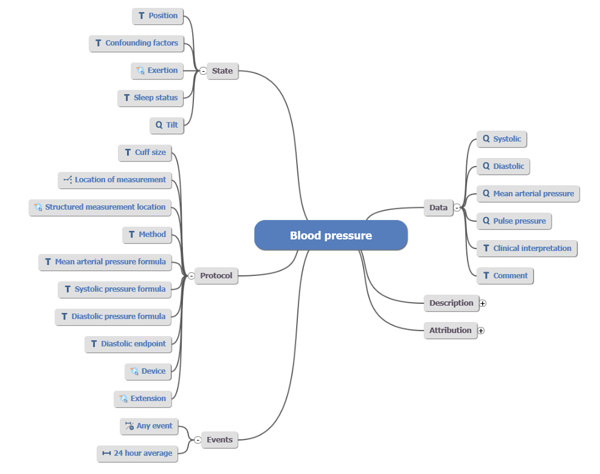

.. _openehr_introduction:

openEHR Introduction
====================

.. warning:: WIP

openEHR is an open platform specification. From a practical perspective you can think
about it as an electronic health record that consists of a database that is wrapped with 
a service layer. The database itself provides only a basic architecture and does
not define the clinical content. This is done in a separate modelling layer. Hence,
from a developer's perspective, openEHR can be understood as a model-driven software
development approach based on an adaptive database that can consume new data definitions
at runtime. This allows to manage the high complexity of the medical domain. 

As of now, openEHR defines the service access layer based on REST. 
However, there could be other protocols used in the future as the underlying openEHR datamodel 
is agnostic in terms of API definition. The following figure gives a high-level summary
of the approach:

.. image:: images/openehr-what_is_it-architecture.png
   :width: 400 px
   :alt: alternate text
   :align: center

The above figure shows the basic concept of separating the clinical definitions on the left side,
from the technical implementation inside the platform (which is EHRbase in our case) on the right side.

Domain experts define the clinical information models (called Archetypes), which are re-usable models of 
clinical concepts. Archetypes follow a formalism called Archetype Definition Language,
that allows to flexibly model clinical concepts. There are several tools that can be
used to create Archetypes in ADL 1.4:

- `Archetype Editor <https://www.openehr.org/downloads/archetypeeditor/home>`_
- `LinkEHR Editor <https://linkehr.veratech.es/>`_
- `ADL Designer <https://tools.openehr.org/designer/>`_ (web only)

The creation of Archetypes is a topic for itself and we will provide another tutorial. Note, that
normally system developers should not be too much concerned with the definition and management of 
Archetypes, as this is the domain of medical information managers and medical professionals.

The goal of Archetypes is to provide standardized sets of data elements and their relations
to achieve defined patterns in structured medical documentation. Hence, Archetypes need a 
strict government to fulfil their potential of enabling semantic interoperability. These models can 
already contain references to clinical terminologies (e.g. LOINC or SNOMED CT) and 
particular value sets. 

The following image shows the mindmap representation of an Archetype to store data about a 
blood pressure measurement:

It is obvious that this model is very detailed. This is because Archetypes aim to capture the 
requirements of different medical specialities. This means, that use-cases from a simple measurement
at the general practitioner as well as a detailed assessment through a cardiologist needs to be supported.
Normally, the full richness of the model will be reduced before usage in a real-world application.
   
The governance of Archetypes happens inside a domain model repository. The most commonly used tool is
the `Clinical Knowledge Manager <https://openehr.org/ckm>`_ (CKM)). For international standardization
efforts, the CKM is the first address to go to. As local needs cannot be avoided, there are also
national instances of the Clinical Knowledge Manager, for example in `Germany <https://ckm.highmed.org>`_ or
`Norway <https://arketyper.no>`_

To represent actual clinical use-cases, elements from Archetypes need to be combined inside a 
Template. You can think of Templates as data sets that can be used to capture data in a form. To create 
a Template, there are currently two tools available:

- `Template Designer <http://downloads.oceaninformatics.com/downloads/TemplateDesigner/>`_
- `ADL Designer <https://tools.openehr.org/designer/>`_ (web only)

We will soonly add another tutorial to give some more details about the creation of Templates.
The Template Designer and the ADL Designer have an export format called Operational Template (OPT).
This format is used to inject the use-case specific definitions (that are based on Archetypes)
into the openEHR platform (like EHRbase).

This can be done using the `POST Template Endpoint <https://specifications.openehr.org/releases/ITS-REST/latest/definitions.html#definitions-adl-1.4-template-post>`_  
of the openEHR REST API. 

Now we can take a look at the clinical applications that are based on the openEHR platform. Here, the approaches
can differ. The challenge is that the openEHR Reference Model is quite technical a generic to provide optimal
handling for computation like validation, storage and querying.

Hence, intermediate formats are often used to make life simpler for developers. In the case of EHRbase, we use the OPT
files to enable data-driven development. In the `EHRbase Client Library  <https://github.com/ehrbase/ehrbase_client_library/>`_
OPTs are used to automatically generate Java classes that can be used to easily build data instances. A data instance in 
openEHR is called a **composition**. 

To allow easier handling, classes are automatically created from the OPT and are much easier for humans to handle. Once data is created, it
is transformed to the canonical formats and sent to the openEHR server to a patient's electronic health record. The composition can 
either be sent alone or as part of a bigger transaction, called a **Contribution**, which can contain different operations 
on several objects inside the electronic health record, including compositions and folders.

On the server-side, it is checked that all elements inside the composition are valid according to the constraints 
that were defined in the respective Archetypes and the Template. Once the data has passed all tests, it is permanently 
stored within a patient's electronic health record. Normally, data can only be updated or logically deleted (in contrast to a physical delete)
as electronic health records require a full audit trail about the patient data. 

Once the data is stored, it can be retrieved through the openEHR REST API. The most common use-case is to fill user interfaces, for
example to plot a list of the latest medications or lab values. This can be done using the Archetype Query Language, a model-based
query formalism that only relies on definitions from the Archetypes. 

 

 

