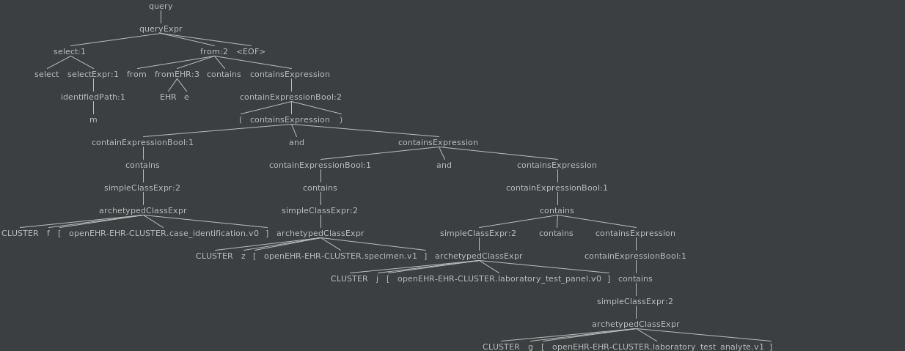
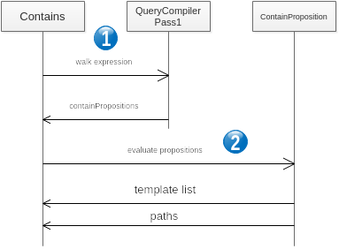

New Contain Clause Resolution Strategy
======================================

C. Chevalley 3.7.20

Backgroud
=========

AQL specifies the important clause 'CONTAINS'. This allows to specify a containment criteria on specified archetypes anywhere into composition projections. The specification is found in `openEHR AQL containment <https://specifications.openehr.org/releases/QUERY/latest/AQL.html#_containment>`_. As mentioned in the specification, 'CONTAINS' specifies an *hierarchical* relationship with the Tree based data architecture (hence not to be confused with a WHERE clause criteria). Hierarchical constraint is modelized using connected and `acyclic graph <https://en.wikipedia.org/wiki/Directed_acyclic_graph>`_\ ; a node can be accessed from the root through a unique path.

Previous Approach
-----------------

The previous strategy was based on maintaining a specific containment table based on a hierarchical data representation using PostgreSQL `ltree <https://www.postgresql.org/docs/11/ltree.html>`_. The algorithm was based on identified AQL paths during the composition serialization: each path expression was then stored in a simplify way as to describe the hierarchy of archetypes within the composition, this for each composition. The table was then used to build  the SQL expression corresponding to an AQL statement:

* identify the template(s) matching the contain clause
* retrieve the path for a given contain constraint for each identified template(s)

The resulting SQL expression is a combination (UNION) of SQL statement for each template.

An example of containment records is as follows:

.. list-table::
   :header-rows: 1

   * - composition UUID
     - label (ltree hierarchical definition)
     - AQL path
   * - dcab36c-d67c-4706-984f-73c96db756bf
     - openEHR_EHR_COMPOSITION_progress_note_v0.openEHR_EHR_OBSERVATION_news2_v0
     - /content[openEHR-EHR-OBSERVATION.news2.v0 and name/value='NEWS2 Score']
   * - 9dcab36c-d67c-4706-984f-73c96db756bf
     - openEHR_EHR_COMPOSITION_progress_note_v0.openEHR_EHR_SECTION_vital_signs_v0.openEHR_EHR_OBSERVATION_body_temperature_v2
     - /content[openEHR-EHR-SECTION.vital_signs.v0 and name/value='Vital  signs']/items[openEHR-EHR-OBSERVATION.body_temperature.v2 and  name/value='Body temperature']
   * - 9dcab36c-d67c-4706-984f-73c96db756bf
     - openEHR_EHR_COMPOSITION_progress_note_v0.openEHR_EHR_OBSERVATION_acvpu_v0
     - /content[openEHR-EHR-OBSERVATION.acvpu.v0 and name/value='ACVPU scale']
   * - 9dcab36c-d67c-4706-984f-73c96db756bf
     - openEHR_EHR_COMPOSITION_progress_note_v0.openEHR_EHR_SECTION_vital_signs_v0.openEHR_EHR_OBSERVATION_pulse_v2
     - /content[openEHR-EHR-SECTION.vital_signs.v0 and name/value='Vital  signs']/items[openEHR-EHR-OBSERVATION.pulse.v2 and  name/value='Pulse/Heart beat']
   * - 9dcab36c-d67c-4706-984f-73c96db756bf
     - openEHR_EHR_COMPOSITION_progress_note_v0
     - /composition[openEHR-EHR-COMPOSITION.progress_note.v0]
   * - 9dcab36c-d67c-4706-984f-73c96db756bf
     - openEHR_EHR_COMPOSITION_progress_note_v0.openEHR_EHR_SECTION_vital_signs_v0.openEHR_EHR_OBSERVATION_pulse_oximetry_v1
     - /content[openEHR-EHR-SECTION.vital_signs.v0 and name/value='Vital  signs']/items[openEHR-EHR-OBSERVATION.pulse_oximetry.v1 and  name/value='Pulse oximetry']
   * - 9dcab36c-d67c-4706-984f-73c96db756bf
     - openEHR_EHR_COMPOSITION_progress_note_v0.openEHR_EHR_SECTION_vital_signs_v0.openEHR_EHR_OBSERVATION_blood_pressure_v2
     - /content[openEHR-EHR-SECTION.vital_signs.v0 and name/value='Vital  signs']/items[openEHR-EHR-OBSERVATION.blood_pressure.v2 and  name/value='Blood pressure']
   * - 9dcab36c-d67c-4706-984f-73c96db756bf
     - dcab36c-d67c-4706-984f-73c96db756bf    openEHR_EHR_COMPOSITION_progress_note_v0.openEHR_EHR_OBSERVATION_news2_v0   /content[openEHR-EHR-OBSERVATION.news2.v0 and name/value='NEWS2 Score']openEHR_EHR_COMPOSITION_progress_note_v0.openEHR_EHR_SECTION_vital_signs_v0.openEHR_EHR_OBSERVATION_respiration_v2
     - /content[openEHR-EHR-SECTION.vital_signs.v0 and name/value='Vital  signs']/items[openEHR-EHR-OBSERVATION.respiration.v2 and  name/value='Respiration']
   * - 9dcab36c-d67c-4706-984f-73c96db756bf
     - openEHR_EHR_COMPOSITION_progress_note_v0.openEHR_EHR_SECTION_vital_signs_v0
     - /content[openEHR-EHR-SECTION.vital_signs.v0 and name/value='Vital signs']

 Whenever an AQL expression is parsed, the logic consists in selecting containment records satisfying the CONTAINS clause. F.e. to retrieve all records matching 

``CONTAINS COMPOSITION c CONTAINS OBSERVATION o [openEHR-EHR-OBSERVATION.pulse-oximetry.v1]``

Is translated as

.. code-block:: sql

   SELECT composition_id FROM ehr.contain WHERE label ~= '*.openEHR_EHR_OBSERVATION_pulse_oximetry_v1'

The template Id is then retrieve from the correlation between the composition entry (ehr.entry) and the template_id attribute. The same logic is used to retrieve the path of a particular node relatively to a template.

Although this approach was initially satisfactory, it has been seen as impacting performance whenever the number of records increases. As shown in the above example, the number of entries for a single composition can be significant and, in the lack of proper indexing, the identification of a template may require costly sequential search. Further, the construction of an SQL expression corresponding to an AQL CONTAINS clause was problematic. Another issue was that item_structure in /context/other_context was not referenced in containment and then was not resolved for querying.

New Approach
------------

Assumptions
^^^^^^^^^^^

This approach assumes that all stored compositions are bound to one known template (at the time of this writing, operational template v1.4). A template is known whenever it is defined in the platform, it is stored in the DB in table ``ehr.template_store``

Objectives
^^^^^^^^^^

The new logic consists in resolving an AQL CONTAINS clause by:

* identifying the template(s) matching the constraints
* resolving the paths for the nodes defined in the CONTAINS clause

Identified templates are used to build the resulting SQL expression, each identified template produces a SQL query. At the end of the process, SQL queries are chained by a UNION clause.

Resolved paths are used to construct the json path expression used to query JSONB structure in the DB.

Technical Approach
^^^^^^^^^^^^^^^^^^

Operational Template Traversal
~~~~~~~~~~~~~~~~~~~~~~~~~~~~~~

All resolution are now based on so-called `WebTemplates <https://www.ehrscape.com/reference.html#_template>`_ (class ``OptVisitor``\ ) providing a tree construct detailing all constraints and attributes of an operational template. The tree structure is traversed using JsonPath expressions (see f.e. `Baeldung's guide <https://www.baeldung.com/guide-to-jayway-jsonpath>`_ on this). 

For instance, to check the existence of a node containment and return the corresponding AQL path, the following logic is illustrated as follows.

Assume we want to retrieve the template(s) where the following expression is satisfied:

``contains COMPOSITION c[openEHR-EHR-COMPOSITION.report-result.v1] contains CLUSTER f [openEHR-EHR-CLUSTER.case_identification.v0]``

The corresponding jsonpath expression to traverse the WebTemplate is:

``$..[?(@.node_id == 'openEHR-EHR-COMPOSITION.report-result.v1')]..[?(@.node_id == 'openEHR-EHR-CLUSTER.case_identification.v0')]``

When applied to template ``Virologischer Befund``\ , the following structure is returned (these are the attributes for the retrieved node)

.. code-block:: javascript

    {
        "min" : "1",
        "aql_path" : "/context/other_context[at0001]/items[openEHR-EHR-CLUSTER.case_identification.v0]",
        "max" : "1",
        "children" : " size = 2",
        "name" : "Fallidentifikation",
        "description" : "Zur Erfassung von Details zur Identifikation eines Falls im Gesundheitswesen.",
        "id" : "fallidentifikation",
        "type" : "CLUSTER",
        "category" : "DATA_STRUCTURE",
        "node_id" : "openEHR-EHR-CLUSTER.case_identification.v0",
    }

The corresponding AQL path for node ``openEHR-EHR-CLUSTER.case_identification.v0`` in template ``Virologischer Befund`` is ``/context/other_context[at0001]/items[openEHR-EHR-CLUSTER.case_identification.v0]``

The corresponding WebTemplate section for this particular node is represented as follows:

.. code-block:: javascript

                 {
                   "min": 1,
                   "aql_path": "/context/other_context[at0001]/items[openEHR-EHR-CLUSTER.case_identification.v0]",
                   "max": 1,
                   "children": [
                     {
                       "min": 1,
                       "aql_path": "/context/other_context[at0001]/items[openEHR-EHR-CLUSTER.case_identification.v0]/items[at0001]",
                       "max": 1,
                       "name": "Fall-Kennung",
                       "description": "Der Bezeichner/die Kennung dieses Falls.",
                       "id": "fall_kennung",
                       "category": "ELEMENT",
                       "type": "DV_TEXT",
                       "constraints": [
                         {
                           "aql_path": "/context/other_context[at0001]/items[openEHR-EHR-CLUSTER.case_identification.v0]/items[at0001]/value",
                           "mandatory_attributes": [
                             {
                               "name": "Value",
                               "attribute": "value",
                               "id": "value",
                               "type": "STRING"
                             }
                           ],
                           "attribute_name": "value",
                           "constraint": {
                             "occurrence": {
                               "min": 1,
                               "max_op": "\u003c\u003d",
                               "min_op": "\u003e\u003d",
                               "max": 1
                             }
                           },
                           "type": "DV_TEXT"
                         }
                       ],
                       "node_id": "at0001"
                     },
                     {
                       "aql_path": "/context/other_context[at0001]/items[openEHR-EHR-CLUSTER.case_identification.v0]/items",
                       "name": "Items",
                       "attribute": "items",
                       "id": "items",
                       "occurrence": {
                         "min": 1,
                         "max_op": "\u003c\u003d",
                         "min_op": "\u003e\u003d",
                         "max": 1
                       },
                       "category": "ATTRIBUTE",
                       "type": "ITEM"
                     }In other terms, t
                   ],
                   "name": "Fallidentifikation",
                   "description": "Zur Erfassung von Details zur Identifikation eines Falls im Gesundheitswesen.",
                   "id": "fallidentifikation",
                   "type": "CLUSTER",
                   "category": "DATA_STRUCTURE",
                   "node_id": "openEHR-EHR-CLUSTER.case_identification.v0"
                 },

Whenever the node_id is not specified, the jsonpath expression uses class names. For example the following AQL

``SELECT location FROM EHR e CONTAINS COMPOSITION CONTAINS ADMIN_ENTRY CONTAINS location [openEHR-EHR-CLUSTER.location.v1]``

Is translated as:

``$..[?(@.type == 'COMPOSITION')]..[?(@.type == 'ADMIN_ENTRY')]..[?(@.node_id == 'openEHR-EHR-CLUSTER.location.v1')]``

AQL Clause Interpretation
~~~~~~~~~~~~~~~~~~~~~~~~~

Contains clause interpretation consists in parsing the AQL expression (ANTLR) and create a corresponding list of propositions to evaluate. 

The logic is based on the recursive traversal of the tree expression (\ `AST <https://en.wikipedia.org/wiki/Abstract_syntax_tree>`_\ ), from bottom left to the top of the tree, and create the template traversal query as well as the boolean validations if any if the expression contains logical operators (AND, OR, XOR ...).

The evaluation does check first simple containment chains (CONTAINS...CONTAINS...CONTAINS...) using WebTemplate traversals described above, and then checks the logical propositions based on these.

Example
"""""""

AQL expression:

.. code-block:: sql

       select
       m
       from EHR e
       contains (
           CLUSTER f[openEHR-EHR-CLUSTER.case_identification.v0] and
           CLUSTER z[openEHR-EHR-CLUSTER.specimen.v1] and
           CLUSTER j[openEHR-EHR-CLUSTER.laboratory_test_panel.v0]
           contains CLUSTER g[openEHR-EHR-CLUSTER.laboratory_test_analyte.v1])

The containments are evaluated with the following tree

The containments are evaluated as follows:

#. "\ **CLUSTERf[openEHR-EHR-CLUSTER.case_identification.v0]**\ " -
#. "\ **CLUSTERz[openEHR-EHR-CLUSTER.specimen.v1]**\ "
#. "\ **CLUSTERg[openEHR-EHR-CLUSTER.laboratory_test_analyte.v1]**\ " as in ``CLUSTER j[openEHR-EHR-CLUSTER.laboratory_test_panel.v0]  contains CLUSTER g[openEHR-EHR-CLUSTER.laboratory_test_analyte.v1]``\ )
#. "\ **CLUSTERz[openEHR-EHR-CLUSTER.specimen.v1] and CLUSTERj[openEHR-EHR-CLUSTER.laboratory_test_panel.v0]containsCLUSTERg[openEHR-EHR-CLUSTER.laboratory_test_analyte.v1]**\ ": check the INTERSECTION of the results from 2 AND 3 above
#. "\ **CLUSTERf[openEHR-EHR-CLUSTER.case_identification.v0] and CLUSTERz[openEHR-EHR-CLUSTER.specimen.v1]andCLUSTERj[openEHR-EHR-CLUSTER.laboratory_test_panel.v0]containsCLUSTERg[openEHR-EHR-CLUSTER.laboratory_test_analyte.v1]**\ ": check the INTERSECTION of the results from 1 & 4
#. "\ **(CLUSTERf[openEHR-EHR-CLUSTER.case_identification.v0]andCLUSTERz[openEHR-EHR-CLUSTER.specimen.v1]andCLUSTERj[openEHR-EHR-CLUSTER.laboratory_test_panel.v0]containsCLUSTERg[openEHR-EHR-CLUSTER.laboratory_test_analyte.v1])**\ ": same as 5 since it is enclosed in parenthesis.

If another operator is used: OR or XOR, then we apply UNION or DISJUNCTION respectively.

DB Changes
~~~~~~~~~~

The two most significant changes are

#. Deprecation of table ehr.containment. This table is now removed, as well as all logic associated to its population.
#. New encoding of composition entry (item_structure)

The composition entry encoding (jsonb) has now the composition name encoded outside the json structure as a dv_coded_text (UDT) in table ehr.entry and removed from the archetype node id in the composition path.

This change is required since now the identified path is a generic AQL path without composition dependent values. 

.. code-block:: json

   {
     "/name": [
       {
         "value": "Bericht"
       }
     ],
     "/$CLASS$": "Composition",
     "/composition[openEHR-EHR-COMPOSITION.report.v1 and name/value='Bericht']": {
       "/content[openEHR-EHR-OBSERVATION.blood_pressure.v2]": [
         {
           "/name": [
             {
               "value": "Blutdruck"
             }
           ],
           "/$CLASS$": "Observation"
   }

The name/value attribute in the node id is now passed as an external attribute 'name' and the composition item_structure is encoded as

.. code-block:: json

   {
     "/name": [
       {
         "value": "Bericht"
       }
     ],
     "/$CLASS$": "Composition",
     "/composition[openEHR-EHR-COMPOSITION.report.v1]": {
       "/content[openEHR-EHR-OBSERVATION.blood_pressure.v2]": [
         {
           "/name": [
             {
               "value": "Blutdruck"
             }
           ],
           "/$CLASS$": "Observation
   }

While name is

``(Bericht,,,,)``

Processing
~~~~~~~~~~

The sequence of containment resolution is the following

#. Consists in parsing the AQL CONTAINS expression and build the propositions as described above.
#. The propositions are evaluated as

   #. Simple containment chains using cached WebTemplates
   #. Computed boolean expressions based on the simple containment chains

Further Enhancements
~~~~~~~~~~~~~~~~~~~~

#. At this stage, ehr_status/other_details is not part of the contains resolution. The main issue here is that it is generally not associated to a valid template.
#. There need to do more research for archetype_slots in a ANY type.
