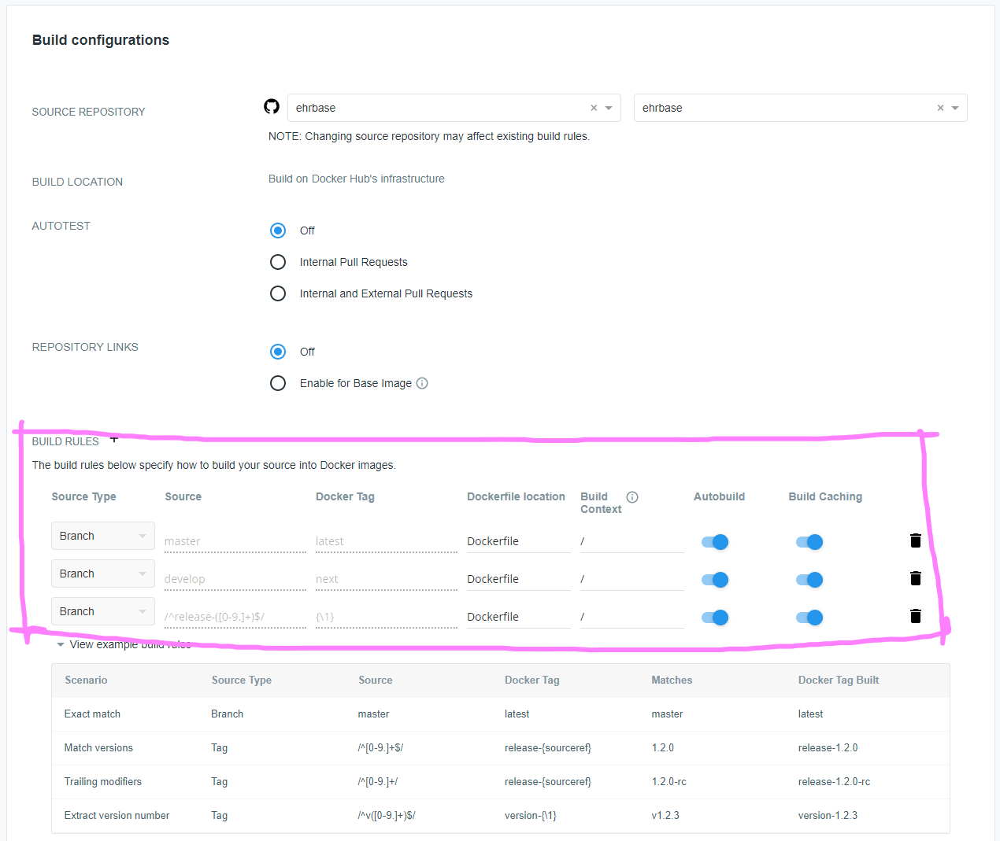

Public Docker Images
====================

This project uses `Docker Hub / Cloud <https://hub.docker.com/>`_ infrastructure to automatically build and publish Docker images on the public Docker Hub Registry whenever there is an update to the code - check recent `EHRbase Docker image tags <https://hub.docker.com/r/ehrbaseorg/ehrbase/tags>`_.

Docker Hub Autobuilds
------------------

An EHRbase Docker image is created and published on `Docker Hub Registry <https://hub.docker.com/r/ehrbaseorg/ehrbase>`_ on every push/merge to `master`, `develop` and `release-*` branch.
Created Docker images are tagged as shown in table below:

.. csv-table::
   :header: "Branch", "Docker Tag", "Example"

        master, latest, `ehrbaseorg/ehrbase:latest` 
        develop, next, `ehrbaseorg/ehrbase:next`
        release-*, semversion, `ehrbaseorg/ehrbase:0.13.0`

Docker Hub Configuration
------------------------

.. note:: This part serves only as a reference and does not have to be repeated - it describes what was needed to do to configure automated Docker image builds on Docker Hub.

1. Create a Dockerfile in root of Github repository
2. Login to Docker Hub (docker.com) w/ the tech-user
3. Login to Github as the "real" owner of the Organisation
4. Connect the "real" owner to Docker Hub granting access to EHRbase Organisation to enable Autobuilds

.. image:: images/dockerhub_config_1.png
   :target: images/dockerhub_config_1.png
   :alt: Connect Docker Hub with your Github Org

.. warning:: It is not sufficient to connect the tech-user although he has owner privileges in EHRbase Organisation. Once the connection by "real" owner is established everything else can be configured w/ the tech-user login to Docker Hub (docker.com)

.. image:: images/dockerhub_config_2.png
   :target: images/dockerhub_config_2.png
   :alt: Use the real owner of the Github Org or repository to establish connection

5. Go to Builds / Configure Automated Builds

.. image:: images/dockerhub_config_3.png
   :target: images/dockerhub_config_3.png
   :alt: Go to Builds and then to Configure Automated Builds

6. Set Up Build Rules

