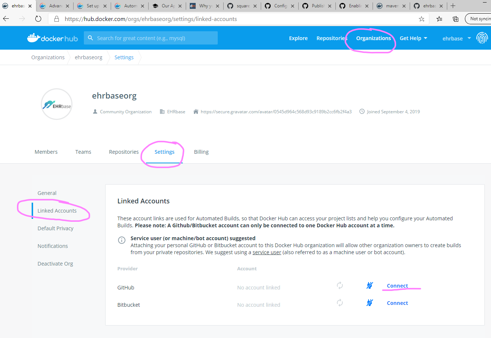
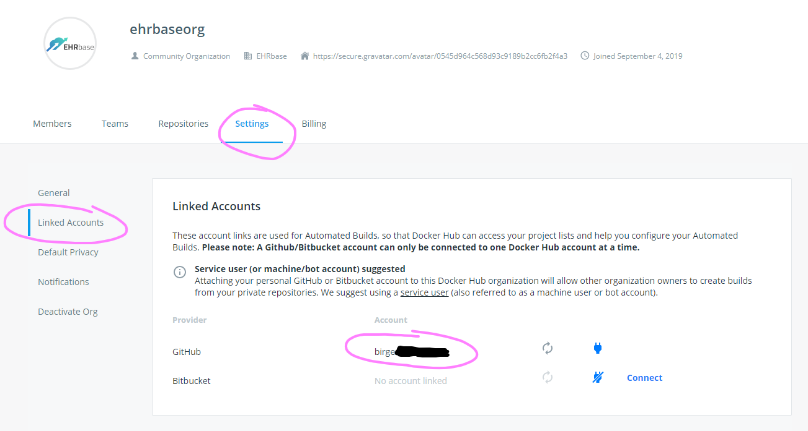
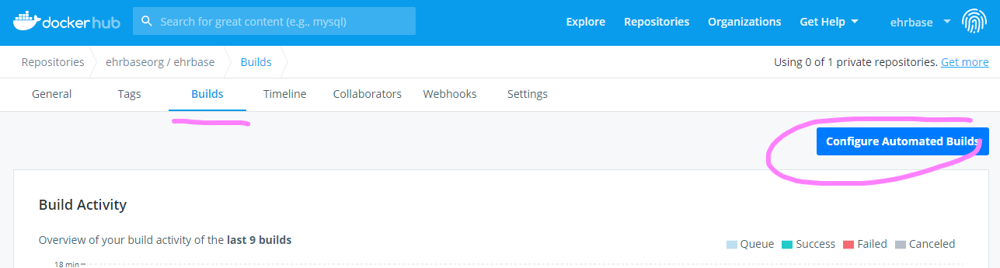
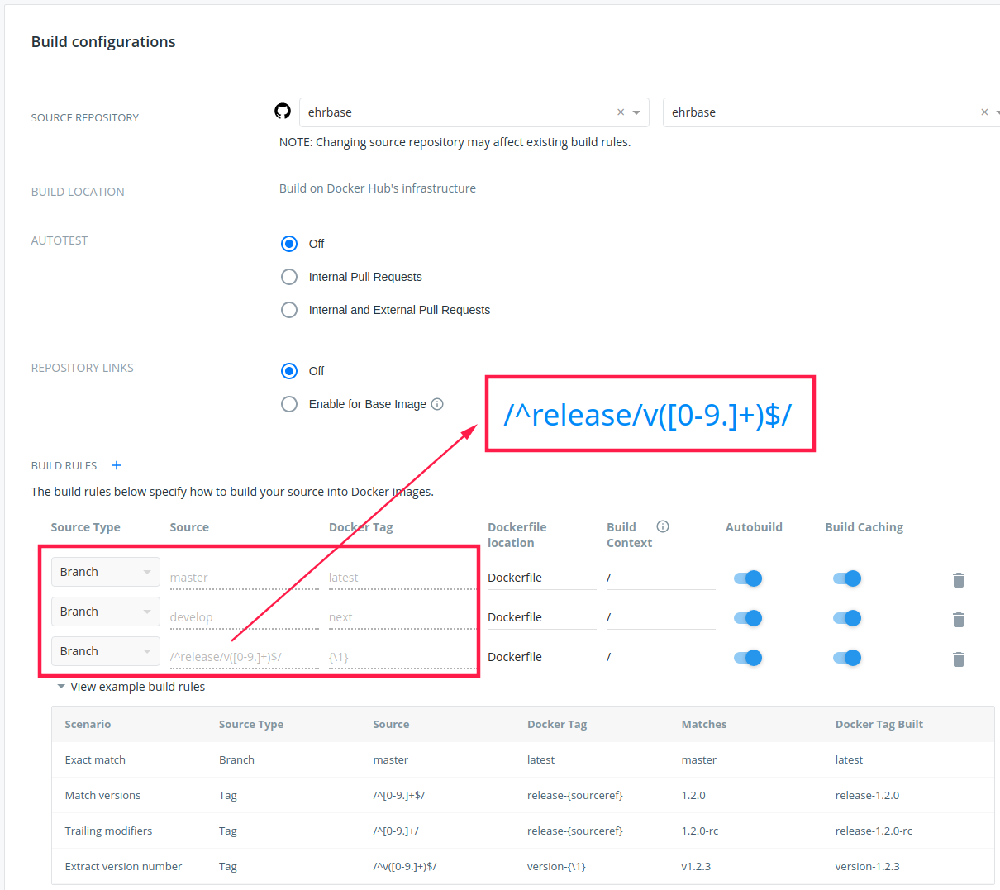

Docker Hub Configuration
------------------------

.. note:: This part serves only as a reference and does not have to be repeated - it describes what was needed to do to configure automated Docker image builds on Docker Hub.

1. Create a Dockerfile in root of Github repository
2. Login to Docker Hub (docker.com) with the tech-user
3. Login to Github with the tech-user (he has owner access to the Organisation)
4. Connect tech-user to Docker Hub granting access to EHRbase Organisation to enable Autobuilds

5. Go to Builds / Configure Automated Builds

6. Set Up Build Rules

