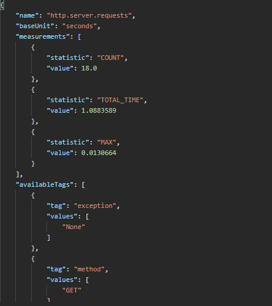

***************
/status/metrics
***************

.. note:: Added in EHRbase version 0.15.0

The metrics service provides multiple useful data on the usage of EHRbase since startup of the
service. These could be for example the number of requests that have been served to clients
and also information on the response types and errors.

You can get an overview on all supported metrics that can be served with this endpoint via *GET*
to the path */status/metrics*. This will return a list in JSON format with all possible values
for more detailed metrics that have to be requested in a separate request.

Example output:

.. image:: ../../../images/status_metrics_example_response.png

You can use the values from this list in a further request as the sub-path of metrics and you
will get the detailed metric for that point.

As an example you can use the path **http.server.reqests** to get information on all serves http
requests as shown below:

This example shows also a list of available tags. If you see a list you can filter and aggregate
the resuklts by using query paramerters on the same metric.

In our example we can also apply a filter for all unauthorized request by adding the tag like this:
**/status/metrics/http.server.requests?tag=status:401** which could look like this:

.. image:: ../../../images/status_metric_http_tag_example_response.png

You can find more information on using tags on metrics in the `official documentation <https://docs.spring.io/spring-boot/docs/current/reference/html/production-ready-features.html#production-ready-metrics-endpoint>`_.
