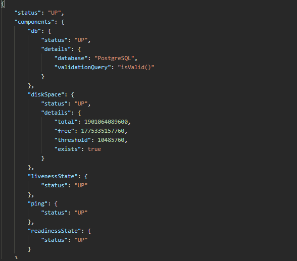

***********************
/management/health
***********************

.. note:: Added in EHRbase version 0.15.0

The health endpoint provides information on the current status of the running EHRbase service
process. Therefore it can provide information on *liveness* (service started) and *readiness*
(service is available to serve requests) whis is often used by cloud orchestration software like
Kubernetes.

If Spring-Boot-Actuator detects a Kubernetes environment the probes for liveness and readiness are
enabled automatically. If you like to test the endpoints outside a Kubernetes environment open file
*application.yml* inside application module and set value *managment->endpoint->health->probes->
enabled* to **true** and re-build and re-start EHRbase.

An example response for health on Kubernetes would look like this:

This example also contains the output of the probes for liveness and readiness. If the status equals
**UP** the probe reports success.

See the `official documentation <https://docs.spring.io/spring-boot/docs/current/reference/html/production-ready-features.html#production-ready-health>`_ for more information.

