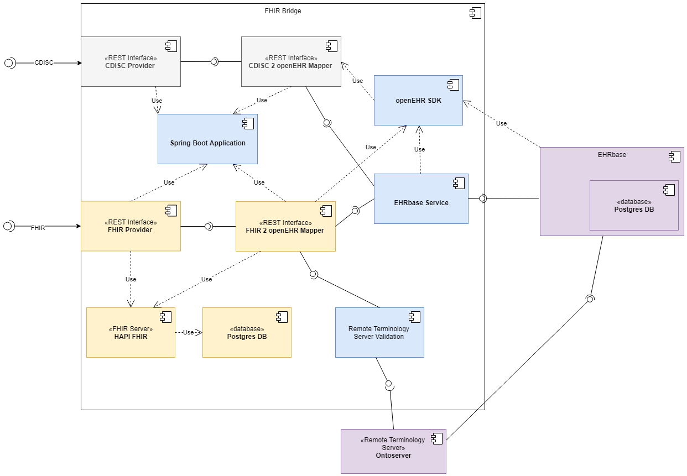

.. _fhir_bridge:

========
Overview
========

The FHIR Bridge is a component designed as a broker between an HL7 FHIR client and an openEHR server.
It contains several ad-hoc integrations for creating, searching and getting data using the
FHIR formats in the front-end and the openEHR data structures in the backend. It helps to transform data in the FHIR format to openEHR compositions. 
It implements FHIR endpoints based on the HAPI FHIR implementation, validates incoming data, transforms data from FHIR to openEHR 
(based on manually created data mapping classes), stores the FHIR resources in an internal database (including a status information 
regarding the transformation) and also provides functions to get data back out from an openEHR data repository (GET and FHIR Search). For the 
COVID-19 platform, the focus lies on the integration of the GECCO data set, the German COVID-19 consensus data set. 

You can clone the project from https://github.com/ehrbase/fhir-bridge

Design decisions
----------------

1. Each integration is designed and developed ad-hoc, there is no generic solution to map FHIR into openEHR and viceversa.
2. On the FHIR side the type of resource is needed, and a correspondent profile. For some resources there might not be a profile
   available, which is not ideal since semantics for data mapping depend on speicifc FHIR profiles.
3. On the openEHR side, the Operational Templates are needed (OPT).
4. Data mappings are mainly done between a FHIR profie and an openEHR OPT.
5. To support the 'create' FHIR operation, a mapping should be designed and implemented to receive a FHIR resource, map it's data
   to an openEHR COMPOSITION, and submit that COMPOSITION to the openEHR Server.
6. To support the 'search' FHIR operation, an openEHR query (AQL) should be designed to get the required data from the openEHR
   Server to map to FHIR resources to be retrieved. We chosen to return the COMPOSITION.uid as the FHIR resource id.
7. To support the 'read' FHIR operation, we use the COMPOSITION.uid retrieved as the FHIR resource id in the search, as the FHIR
   resource identifier to get the individial resource.

Architecture Overview
---------------------

   
The FHIR bridge is mainly implemented over Spring Boot (application + configuration), using HAPI FHIR to process all FHIR related
requests, expose API endpoints (via "resource providers") and support all FHIR resource structures.  Currently, the FHIR Bridge implements endpoints for HL7 FHIR (R4) 
in accordance with the German Corona Consensus Data Set (GECCO) and the profiles and resources of the Medical Informatics Initiative.

The controller forward the data to the mapping classes which mainly use the openEHR Software Development Kit (SDK) for conducting the mapping and transformation. The SDK
has a code generator which allows to automatically generate Java classes from openEHR Templates (using the Operational Template Format (OPT)). These generated classes 
can be directly incorporated to build objects representing a human-friendly format for handling openEHR data. Moreover, the SDK encapsulates the REST calls
of the official openEHR REST API and provides convenience functions that are implemented within the Mapper and the EHRbase Service components.

 
Extensibility
-------------

Above figure shows the ability of the FHIR Bridge to implement endpoints for further data formats. As the application is based on Spring Boot, it is possible to 
add new services using the same application and configuration. Such a mapping, for example for CDISC ODM or HL7 CDA. To achieve this, there is only the need to
add a new Spring Rest Service with the expected parameters and a corresponding Mapper component. The other components can be re-used.  

Testing
-------

We preparated a set of HTTP requests to be able to tests different services of the FHIR bridge. The requests work on Insomnia REST
Client (https://insomnia.rest/).

Just install Insomnia, and import this file: https://github.com/ehrbase/fhir-bridge/blob/develop/src/test/resources/Insomnia_2020-07-27.json

Both, the openEHR server (EHRBASE) and FHIR bridge need to be running to be able to test.

